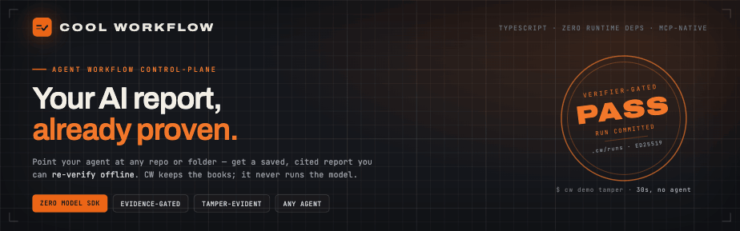
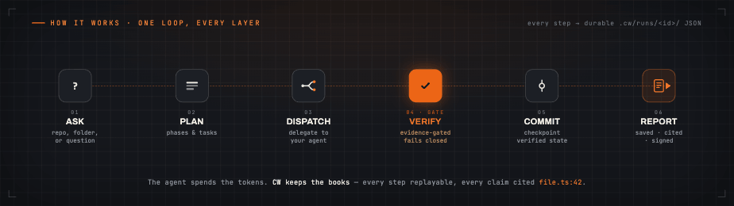
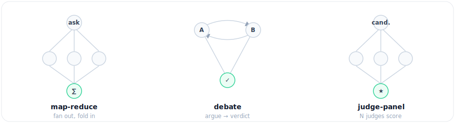

<div align="center">



<br><br>

[](https://github.com/coo1white/cool-workflow/actions/workflows/ci.yml)
[](https://www.npmjs.com/package/cool-workflow)
[](https://www.npmjs.com/package/cool-workflow)
[](https://www.npmjs.com/package/cool-workflow)
[](https://github.com/coo1white/cool-workflow/tags)
[](LICENSE)

### Get a saved, cited report from your AI agent — not a chat message you lose.

</div>

Point an AI coding agent at a repo (or any folder of docs) and Cool Workflow turns the run into a
**durable, inspectable workflow**: it plans the work, delegates each task to *your* agent, records and
verifies every result, then writes a report where every claim is cited to a `file.ts:42`.

> **The model is fuel. CW is the black-box recorder, the dashboard, and the gearbox — never the engine.**
> It never calls a model API, never holds your keys, and never uploads your code. Your agent spends the
> tokens; CW keeps the books — as plain JSON on your own disk.

---

## Install

```bash
npm install -g cool-workflow
```

<details>
<summary>Or install with <b>Homebrew</b></summary>

```bash
brew tap coo1white/cool-workflow https://github.com/coo1white/cool-workflow
brew install coo1white/cool-workflow/cool-workflow
cw version
```

Upgrade later with `brew update && brew upgrade cool-workflow`.
</details>

**You need:** Node.js v18+ and one agent CLI on your machine — `claude`, `codex`, `gemini`, or
`opencode` (all auto-detected). No agent yet? `cw demo` still works — **CW never runs a model itself.**

## Quick Start

### 1 · Prove it works — 30 seconds, no agent needed

```bash
cw demo tamper
# → builds a real signed ledger, forges it three ways, catches all three offline
# → VERDICT: tamper-evidence holds ✓
```

### 2 · Ask a question about your code — one command

```bash
cw -q "What are the main risks here?"
```

CW auto-detects the current repo and the first agent on your `PATH`. Pin a specific one with a flag
(`-claude`, `-codex`, `-gemini`, `-deepseek`). Point it anywhere — no `cd` required — or review a
**remote repo by URL** and CW clones, snapshots, and reviews the checkout:

```bash
cw -q "What are the security risks?" -dir /path/to/project
cw -q "What are the risks?" --link https://github.com/owner/repo
```

**Not just code.** Aim CW at a folder of docs, notes, or papers and it reads them as sources for the
same saved, cited report:

```bash
cw quickstart research-synthesis --repo /path/to/papers \
  --question "What do these papers conclude?"
```

### 3 · Open the report

The command prints the path. Every finding carries a clickable `file.ts:42` pointer:

```bash
cat .cw/runs/<run-id>/report.md
```

While it runs you get a calm, Claude-Code-style live view — a compact rolling window of tool calls
that updates in place instead of an endless wall — and a clean findings table when it's done.

---

## Why Cool Workflow

Most agent tooling runs a whole task as one long prompt, then hands you a chat message. When the work
is long, parallel, or high-stakes, you can't tell what happened or trust the result. CW treats it as a
**runtime problem** — and rests on four commitments:

| Commitment | What it means for you |
|---|---|
| **Model as fuel, not engine** | CW never calls a model API. Execution is always delegated to your agent, so the backend is swappable and your credentials and code never leave your machine. |
| **Evidence-gated decisions** | Every adopted result records its **basis, authority, rationale, and the alternative it beat.** Missing evidence doesn't slip through — it fails closed to a visible `unexplained` state. |
| **Deterministic, local replay** | Every step is plain JSON under `.cw/runs/<id>/` — read it, diff it, resume it, replay it. No hidden database; the runtime never *guesses* success. |
| **Vendor-neutral by design** | One source-of-truth manifest generates every vendor adapter (Claude, Codex, …) over a shared CLI + MCP runtime, with a fail-closed drift check. No lock-in, no forked logic. |

## How It Works

CW is a small TypeScript tool with **zero runtime dependencies**. It drives your agent over a repo — or
any folder — in saved, replayable stages, writing everything to disk as inspectable files. It never
imports a model SDK or stores an API key.

<div align="center">

</div>

```text
ask simple → run simple → verify simple → resume simple
```

## What You Can Run

| Workflow | What it produces |
|---|---|
| `architecture-review` | Map a repo, rank risks, and back every claim with `file:line` evidence |
| `pr-review-fix-ci` | Review a PR or branch, diagnose CI, and propose + verify fixes |
| `research-synthesis` | Answer a question over a local folder of files — your docs, notes, or papers |
| `release-cut` | Run a gated, reviewed release with dry-run evidence |

```bash
cw app list            # see everything installed
cw doctor              # check your setup    →    cw fix   shows the fix commands
```

**Multi-agent, when you need it.** Fan work out across agents with built-in topologies, compose flows
(a task can run a whole child workflow with `subWorkflow`, or a `loop()` phase can iterate until a
predicate or token budget says stop), and re-run fast — `cw run <app> --drive --incremental` reuses
every step whose inputs didn't change.

<div align="center">

</div>

## Can You Trust the Report?

CW doesn't run the model — it keeps the books. Your agent signs its findings (**ed25519**), and
`cw report verify-bundle` checks — **offline, with nothing but the public key** — that every signed
finding is in the report unaltered. Edit a finding, in the report or in the agent's own result, and the
check fails. CW holds no private key: the agent signs, CW only verifies.

```bash
cw demo tamper                                  # proves it in 30s — edits a signed result, watch it fail
cw -q "…" --bundle                              # seal a run into one portable file
cw report verify-bundle report.cwrun.json       # anyone can re-check it offline, with just the file
```

This attests the agent's **signed findings** — not that nothing else was added or that nothing was left
out. For exactly what is and isn't proven, see the **[Trust Model](plugins/cool-workflow/docs/trust-model.md)**.

## Use It From Your Editor

CW exposes the same runtime over **MCP** — **Claude Desktop, Cursor, and VS Code call CW as a tool**, so
your agent can plan a run, drive it, and verify a report without leaving the editor. CLI and MCP share
one registry and are parity-checked. See the **[Wiki](https://github.com/coo1white/cool-workflow/wiki)**.

## Troubleshooting

| Problem | Fix |
|---|---|
| No agent found | `cw doctor` — shows which agents are on your machine |
| `status: blocked` | Set `CW_AGENT_COMMAND=builtin:claude` or pass `-claude` |
| `claude: command not found` | Install Claude Code and run again |
| Where is my report? | `<repo>/.cw/runs/<id>/report.md` |

## Docs & Wiki

New here? Start with the **[Wiki](https://github.com/coo1white/cool-workflow/wiki)** →
[Getting Started](https://github.com/coo1white/cool-workflow/wiki/Getting-Started) ·
[Mental Model](https://github.com/coo1white/cool-workflow/wiki/Mental-Model) ·
[Glossary](https://github.com/coo1white/cool-workflow/wiki/Glossary) ·
[Trust & Audit](https://github.com/coo1white/cool-workflow/wiki/Trust-And-Audit)

Building on CW? See the [Getting Started doc](plugins/cool-workflow/docs/getting-started.md),
[Project Index](plugins/cool-workflow/docs/project-index.md), and
[CLI ↔ MCP Parity](plugins/cool-workflow/docs/cli-mcp-parity.7.md).

CW dogfoods its own release process — every cut runs the `release-cut` workflow against this repo.

## License

BSD-2-Clause. Built by COOLWHITE LLC.
