<div align="center">

# Cool Workflow

**Get a saved, cited report from your AI agent — not a chat message you lose.**

[](https://github.com/coo1white/cool-workflow/actions/workflows/ci.yml)
[](https://www.npmjs.com/package/cool-workflow)
[](https://www.npmjs.com/package/cool-workflow)
[](https://www.npmjs.com/package/cool-workflow)
[](https://github.com/coo1white/cool-workflow/tags)
[](LICENSE)



</div>

## Install

```bash
npm install -g cool-workflow
```

What you need: **Node.js v18+** (`node --version`) and one AI agent CLI on your machine
(`claude`, `codex`, `gemini`, or `opencode`). No agent? `cw demo` still works — CW never runs a model itself.

## Quick Start (3 steps)

### 1. Prove it works (30 seconds, no agent needed)

```bash
cw demo tamper
# → VERDICT: tamper-evidence holds ✓
```

### 2. Run a review on your code — one command

```bash
cw -q "What are the main risks here?"
```

CW auto-detects the repo (current folder) and your agent (first found on PATH).
Pick a specific agent with a flag:

```bash
cw -q "What are the security risks?" -claude
cw -q "What are the security risks?" -codex
cw -q "What are the security risks?" -deepseek
```

`claude`, `codex`, `gemini`, and `opencode` are auto-detected on PATH (no flag needed);
`-deepseek` picks the DeepSeek builtin — no env vars needed.

As the agent works you get a **calm, Claude-Code-style live view** — a compact rolling window that
updates in place instead of an endless wall:

```text
● Read(execution-backend.ts)
  ⎿ 910 lines
● Grep(spawnSync)
  ⎿ 17 matches
✶ Searching worker-isolation.ts… (3s)
```

Each tool folds to a `● ToolName(arg)` line with a dim `⎿` result summary; older steps fold away (the
window stays a few rows) and the worker collapses to one line when done. It's compact by default
(reasoning hidden) — add `--verbose` for the full narration, `--full` to also print the report inline,
or `--no-color` to drop ANSI (`NO_COLOR` / `FORCE_COLOR` are honored too). The complete narration +
tool I/O is always saved to a per-worker `transcript.md` next to the result, and the cursor is
restored cleanly on Ctrl-C.

Review a project **from any directory** — no `cd` needed — by pointing at its folder
(`-d` / `--dir` / `--repo` are equivalent):

```bash
cw -q "What are the risks?" -dir /path/to/project
```

Or review a **remote repo by URL** — CW clones it, then reviews the checkout (`-l` / `--link`,
or pass the URL straight to `-dir`/`--repo`):

```bash
cw -q "What are the risks?" --link https://github.com/owner/repo
cw -q "What are the risks?" --link git@gitlab.com:owner/repo.git --ref v1.2.0
```

GitHub, GitLab, Bitbucket, self-hosted git, `ssh://`, and `file://` all work — as do downloadable
archives (`.tar.gz`/`.tgz`/`.tar`/`.zip`), fetched + extracted + snapshotted before review. The clone is cached
under `~/.local/state/cool-workflow/clones/` and reused next time (`--refresh` re-fetches; `cw clones
list`/`gc` manage it). The report records `Source: <url>@<commit>` plus a tamper-evident
`source.clone` event (`cw audit verify`). A credential-less private repo **fails closed** — it never
hangs on a prompt. Preview without fetching: `cw -q "…" --link <url> --check`.

CW's own phases tick by as it runs, then it prints a clean summary — a **compact findings table**
(id / severity / classification, not the full prose), the report path, and where the per-worker
transcripts live:

```text
==> Map ✓ (6/6)
==> Verdict ✓

Findings: 3 — 2×P1, 1×P2

✓ Report: /path/to/project/.cw/runs/<run-id>/report.md
  ✓ Status: complete — 14/14
  Transcript: /path/to/project/.cw/runs/<run-id>/
  Next: cw report <run-id> --show
```

If something is off, the error names the next move (e.g. `Try: cw doctor`). With `--json`,
stdout is pure data — all of this chrome goes to stderr (TTY only).

### 3. Open the report

The command prints the report path. For example:

```bash
cat .cw/runs/<run-id>/report.md
# → findings with clickable file.ts:42 pointers for every claim
```

## What Else Can It Do?

```bash
cw version                        # show version
cw update                         # update to latest release
cw doctor                         # check your setup
cw fix                            # show fix commands for setup issues
```

| Workflow | Does |
|---|---|
| `architecture-review` | Map a repo, rank risks, back every claim with evidence |
| `pr-review-fix-ci` | Review a pull request, suggest fixes, verify CI |
| `research-synthesis` | Answer a question with fact-backed research |
| `release-cut` | Run a gated, reviewed release |

**Multi-agent, when you need it.** Fan work out across agents with built-in topologies,
compose flows (a task can run a whole child workflow with `subWorkflow`, or a `loop()` phase
can keep iterating until a predicate or a token budget says stop) — and re-run fast:
`cw run <app> --drive --incremental` reuses every step whose inputs didn't change.

<div align="center">

</div>

CW also has an **MCP** surface — **Claude Desktop, Cursor, and VS Code call CW as a tool**, so
your agent can plan a run, drive it, and verify a report without leaving the editor.
See the [wiki](https://github.com/coo1white/cool-workflow/wiki).

## Can I Trust the Report?

CW does not run the AI model — it keeps the books. The agent signs its findings (ed25519), and
`cw report verify-bundle` checks — offline, with nothing but the public key — that every signed
finding is in the report **unaltered**: edit a finding, in the report or in the agent's own result,
and the check fails. CW holds no private key — the agent signs, CW only verifies.

```bash
cw demo tamper                              # proves it in 30s — edits a signed result, watch it fail
cw telemetry verify <run-id>                # checks a real run
```

Give the report to another person — they need nothing but the file:

```bash
cw -q "…" --bundle                              # seal into one portable file
cw report verify-bundle report.cwrun.json       # they check it offline
cw report verify-bundle report.cwrun.json \
  --require-signatures                          # …and insist the findings are signed
```

This attests the agent's **signed findings** — not that the report holds nothing else, and not that
none were left out. CW has no key to sign the rendered report, and a determined re-chainer can drop a
signed finding entirely — so check the findings you act on against the signed results. For exactly
what is and is not proven, see the [Trust Model](plugins/cool-workflow/docs/trust-model.md).

## Troubleshooting

| Problem | Fix |
|---|---|
| No agent found | Run `cw doctor` — it shows which agents are on your machine |
| `status: blocked` | Set `CW_AGENT_COMMAND=builtin:claude` or pass `-claude` |
| `claude: command not found` | Install Claude Code and run again |
| Where is my report? | `<repo>/.cw/runs/<id>/report.md` |
| Need the old README? | See [docs/readme-v0.1.87-full.md](plugins/cool-workflow/docs/readme-v0.1.87-full.md) |

## How It Works

CW is a small TypeScript tool with zero runtime deps. It drives your agent over a repo in
saved, replayable stages — it plans the work, dispatches each task to your agent, records and
verifies every result, then commits and renders the report — writing everything to disk as
inspectable files. It never imports a model SDK or stores an API key.

<div align="center">

</div>

`ask simple → run simple → verify simple → resume simple`

For the full API, multi-agent topologies, execution backends, and the CLI/MCP surface,
see the [wiki](https://github.com/coo1white/cool-workflow/wiki).

CW dogfoods its own release process — every cut runs the `release-cut` workflow against this
repo. See the [full README](plugins/cool-workflow/docs/readme-v0.1.87-full.md) for the
pre-v0.1.87 reference.

## License

BSD-2-Clause. Built by COOLWHITE LLC.
