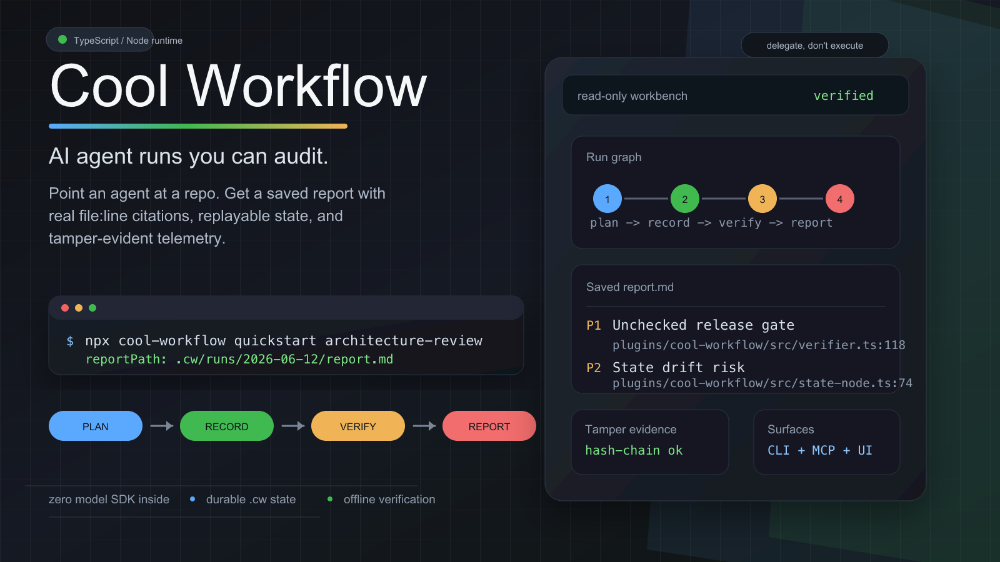

<div align="center">

# Cool Workflow

**Point an AI coding agent at a repo, get a saved report with real citations — not a chat message you lose.**

[](https://github.com/coo1white/cool-workflow/actions/workflows/ci.yml)
[](https://www.npmjs.com/package/cool-workflow)
[](https://www.npmjs.com/package/cool-workflow)
[](https://www.npmjs.com/package/cool-workflow)
[](https://github.com/coo1white/cool-workflow/tags)
[](LICENSE)



</div>

## What is this, really?

You put a question to an AI coding agent, it gives an answer in the chat, and
then the answer is gone. Next week you put the same question and have to start
all over again.

**Cool Workflow (CW) makes that lost question into a kept job.** You point it at
a code store with a question like *"what are the security risks here?"* It runs
your AI agent over all the code in ordered steps and puts a **report file** on
disk — every point backed by an exact `file.js:42` pointer to the line. You are
able to run it again, give it to others, and even give proof that the report was
not changed by anyone.

```
        you ask once                          CW gives you
   "what are the risks in my repo?"     →   a saved report.md with
                                              cited findings, repeatable
```

It does **not** run the AI model itself. You give your own agent (for one, the
`claude` command line) and CW keeps it working, makes a record of what took
place, and checks the answer. Take CW as the *project manager*, and your agent
as the *worker*.

> New to this? You're in the right place — this README is a step-by-step start.
> Deeper/advanced docs live in the [wiki](https://github.com/coo1white/cool-workflow/wiki).

---

## What you need

1. **Node.js** (v18+). Check with `node --version`.
2. **An AI agent on the command line.** The easiest is **Claude Code** — after
   installing it you'll have a `claude` command. Check with `claude --version`.
   (CW also works with `codex`, or any command/HTTP agent — but start with
   `claude`.)

> No agent yet? You are still able to **see CW work** (next part, step 1)
> without one. The full report needs an agent, because CW never makes a call to
> a model itself.

---

## Quick start (3 steps)

### 1. See it run — no install, no agent, no API key

```bash
npx cool-workflow demo tamper
```

This proves CW's headline trick in 30 seconds (more on that
[below](#can-i-trust-the-report)). If you see `VERDICT: tamper-evidence holds ✓`,
everything works.

### 2. Run a real review on your own repo

```bash
npx cool-workflow quickstart architecture-review \
  --repo /path/to/your/project \
  --question "What are the main risks in this codebase?" \
  --agent-command builtin:claude
```

- `--repo` — the folder you want reviewed.
- `--question` — what you want to know.
- `--agent-command builtin:claude` — use the bundled Claude wrapper (read-only;
  it never edits your code).

CW plans the work, drives `claude` over your repo in steps, and prints where it
saved the report. For a live terminal trace while each worker runs, opt in with
`CW_AGENT_STREAM=1`; the trace goes to stderr only and the recorded result is
unchanged.

> **No agent configured?** CW stops safely and tells you so (`status: blocked`) —
> it never makes up an answer. Install `claude` and re-run.

### 3. Read the report

```bash
cat /path/to/your/project/.cw/runs/<run-id>/report.md
```

You'll get a summary, ranked findings, and **clickable citations** like
`src/server.js:18` for every claim — so you can check each one yourself.

---

## Install it (optional)

`npx` always works without installing. To get the short `cw` command everywhere:

```bash
npm install -g cool-workflow      # then use:  cw …   instead of  npx cool-workflow …
```

---

## What else can it do?

CW ships several ready-made "jobs" (run `cw list` to see them all):

| Command | What it does |
|---|---|
| `architecture-review` | Map a repo's structure and rank its real risks, with evidence. |
| `pr-review-fix-ci` | Review a pull request, propose fixes, check CI. |
| `research-synthesis` | Gather and synthesize an evidence-backed answer to a question. |
| `release-cut` | Drive a gated, reviewed release. |

It also exposes the same actions over **MCP**, so editors like Claude Desktop /
Cursor / VS Code can call CW as a tool. See the
[wiki](https://github.com/coo1white/cool-workflow/wiki) for that and for
multi-agent runs.

---

## Can I trust the report?

This is what makes CW different. Because CW only *delegates* to your agent, it
keeps a tamper-evident record of every step: each agent's reported token usage is
cryptographically signed and hash-chained, so **editing the record after the fact
breaks the chain** — and anyone can re-verify it offline with only a public key.

See it for yourself — the `demo tamper` from step 1 forges a record two ways and
catches both:

```text
▶ LEDGER tamper
  after:  ✗ DETECTED — the hash chain caught it: chain-link[2]: telemetry-chain-broken
▶ SIGNATURE tamper
  after:  ✗ DETECTED — signature does not match reported usage
VERDICT: tamper-evidence holds ✓ — every forgery caught offline, with only the public key.
```

On a real run, verify any run's record yourself:

```bash
cw telemetry verify <run-id>
```

CW dogfoods this on its own codebase — see the committed live-run proof in
[`plugins/cool-workflow/docs/dogfood/`](plugins/cool-workflow/docs/dogfood/).

The plain-English point: *the thing that spends the tokens is not the thing that
keeps the books.* That separation is normal in accounting — CW brings it to AI
agents.

---

## Troubleshooting

| Problem | Fix |
|---|---|
| `status: blocked`, `agentConfigured: false` | No agent is set up. Install `claude` (or pass `--agent-command`). |
| `claude: command not found` | Install Claude Code so the `claude` command exists, then re-run. |
| Want to see the plan without running the AI | Add `--preview` — it shows the steps and spawns nothing. |
| Want a live agent trace | Set `CW_AGENT_STREAM=1`. It is stderr-only, TTY-gated, and `CW_NO_STREAM=1` disables it. |
| Where did my report go? | The command prints `reportPath`; it's under `<your-repo>/.cw/runs/<id>/report.md`. |

---

## How it works (one paragraph)

CW is a small, zero-dependency TypeScript/Node runtime. It records the agent loop
explicitly — *plan → dispatch → record → verify → commit → report* — as durable
files on disk, so a run is inspectable and replayable instead of a disposable
chat. It never embeds a model SDK and holds no API key; your configured agent does
the thinking, CW does the bookkeeping and the checking. For the architecture,
multi-agent coordination, execution backends, and the full CLI/MCP surface, see
the **[wiki](https://github.com/coo1white/cool-workflow/wiki)** and
[`plugins/cool-workflow/docs/`](plugins/cool-workflow/docs/).

---

## License

BSD-2-Clause. See [LICENSE](LICENSE). Built by COOLWHITE LLC.
