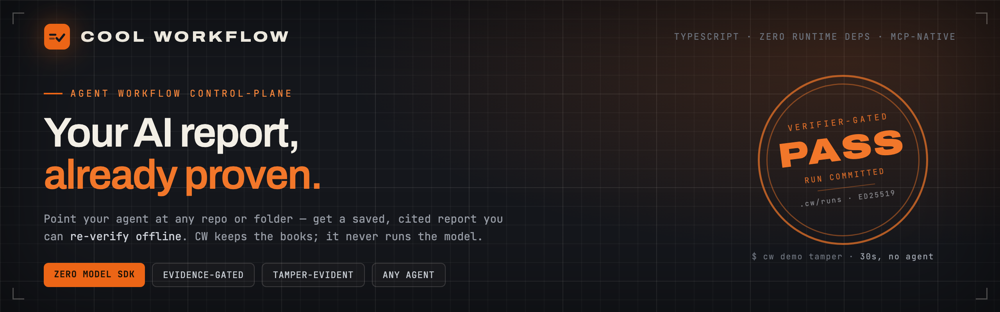
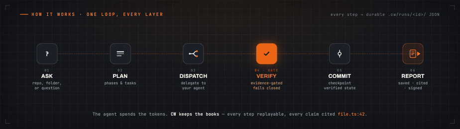
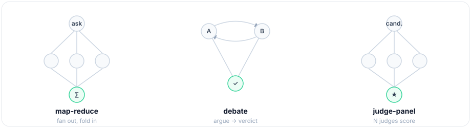

<div align="center">



<br><br>

[](https://github.com/coo1white/cool-workflow/actions/workflows/ci.yml)
[](https://www.npmjs.com/package/cool-workflow)
[](https://www.npmjs.com/package/cool-workflow)
[](https://www.npmjs.com/package/cool-workflow)
[](https://github.com/coo1white/cool-workflow/tags)
[](LICENSE)

### Get a saved report from your AI agent, with every claim tied to a line of code — not a chat answer you lose.

<br>


</div>

## What is this?

You may already use an AI coding agent — a tool like `claude`, `codex`, or
`gemini` that reads your code and answers questions about it. The answer comes
back as a chat message. Chat is easy to lose, and hard to check.

Cool Workflow (`cw`) is a small command-line tool that fixes that. Point it at
a repo — or any folder of docs — and:

- **It plans the work.** Your question becomes a set of small tasks.
- **Your agent does the work.** CW never runs a model itself. Your own agent
  does the reading and the thinking.
- **It keeps a record.** Every step is saved as plain JSON files on your own
  disk, under `.cw/`. You can read them, compare them, and pick a run up again
  later.
- **It checks the results.** A result with no evidence does not get through —
  it stops in a clear `unexplained` state instead.
- **It writes a report.** Every claim points to a real place in your code,
  like `file.ts:42`. Click it and see for yourself.

> **The model is fuel. CW is the black-box recorder, the dashboard, and the gearbox — never the engine.**
> It never calls a model API, never holds your keys, and never uploads your code. Your agent spends the
> tokens; CW keeps the books — as plain JSON on your own disk.

---

## Install

```bash
npm install -g cool-workflow
```

<details>
<summary>Or install with <b>Homebrew</b></summary>

```bash
brew tap coo1white/cool-workflow https://github.com/coo1white/cool-workflow
brew install coo1white/cool-workflow/cool-workflow
cw version
```

Upgrade later with `brew update && brew upgrade cool-workflow`.
</details>

**You need:** Node.js v18 or newer, and one agent CLI on your machine —
`claude`, `codex`, `gemini`, or `opencode`. CW finds them by itself. No agent
yet? Step 1 below still works — **CW never runs a model itself.**

Not sure what you have? `cw doctor` checks your setup and `cw fix` prints the
commands that put it right.

## Quick Start

### 1 · See it work — 30 seconds, no agent needed

```bash
cw demo tamper
# → builds a real signed ledger, forges it three ways, catches all three offline
# → VERDICT: tamper-evidence holds ✓
```

This is CW's trust check working on itself: it makes a signed record, breaks
it on purpose in three ways, and catches all three breaks.

### 2 · Ask a question about your code — one command

Go to any project folder and run:

```bash
cw -q "How does auth work end-to-end here?"
```

Any question works — "how does X work", "is it safe to change Y", "what would
break if Z rotated". CW uses the current repo and the first agent it finds on
your `PATH`. Want a specific agent? Add a flag (`-claude`, `-codex`, `-gemini`,
`-opencode`, `-deepseek`). Note: the `-gemini` and `-deepseek` flags reach
their models through `opencode`, so those two need `opencode` installed and
its provider signed in. DeepSeek also has no auto-detect, so `-deepseek` is
the only way to get it. (A native `gemini` CLI found on your `PATH` is used
directly.) You can point CW at any folder, or at a **repo on the web by
URL** — CW clones it and reviews the copy:

```bash
cw -q "What are the security risks?" -dir /path/to/project
cw -q "Is it safe to swap this queue for Redis?" --link https://github.com/owner/repo
```

**Not just code.** Point CW at a folder of docs, notes, or papers and it reads
them as sources for the same saved report:

```bash
cw quickstart research-synthesis --repo /path/to/papers \
  --question "What do these papers conclude?"
```

### 3 · Open the report

The command prints the path when it is done. Every finding has a clickable
`file.ts:42` pointer:

```bash
cat .cw/runs/<run-id>/report.md
```

While it runs you get a calm live view — a small rolling window of tool calls
that updates in place, not an endless wall of text — and a clean findings
table at the end.

---

## Why Cool Workflow

Most agent tools run a whole task as one long prompt, then hand you a chat
message. When the work is long, parallel, or high-stakes, you cannot tell what
happened or trust the result. CW treats that as a **runtime problem** — like an
operating system keeping processes safe and visible — and rests on four
commitments:

| Commitment | What it means for you |
|---|---|
| **Model as fuel, not engine** | CW never calls a model API. Your agent does all the model work, so you can swap agents freely, and your keys and code never leave your machine. |
| **Evidence-gated decisions** | Every accepted result records its **basis, authority, rationale, and the option it beat.** Missing evidence does not slip through — the result stops in a visible `unexplained` state. |
| **Deterministic, local replay** | Every step is plain JSON under `.cw/runs/<id>/` — read it, diff it, resume it, replay it. No hidden database; the runtime never *guesses* success. |
| **Vendor-neutral by design** | One source-of-truth manifest generates every vendor adapter (Claude, Codex, …) over one shared CLI + MCP runtime, with a fail-closed drift check. No lock-in. |

**What CW is not.** CW is not the model — it never calls a model API and never
holds your keys; your agent does that work in its own process. It is not a CI
system or a build tool — it keeps and checks the record of agent work; it does
not take the place of your tests or your release pipeline. And it is not a big
framework to build on — it is a small set of commands over plain `.cw/` files
on your own disk, not a library your code has to wrap itself around.

## How It Works

CW is a small TypeScript tool with **zero runtime dependencies**. It drives
your agent over a repo — or any folder — in saved stages that you can replay,
writing everything to disk as files you can open and read. It never imports a
model SDK or stores an API key.

<div align="center">

</div>

```text
ask simple → run simple → verify simple → resume simple
```

## What You Can Run

| Workflow | What it produces |
|---|---|
| `architecture-review` | Map a repo, rank risks, and back every claim with `file:line` evidence |
| `pr-review-fix-ci` | Review a PR or branch, work out why CI fails, and propose + verify fixes |
| `research-synthesis` | Answer a question over a local folder of files — your docs, notes, or papers |
| `release-cut` | Run a gated, reviewed release with dry-run evidence |

Every app writes the same thing: a saved report you can check again offline,
with every claim tied to its source. These four are the main lanes;
`cw app list` shows all eight installed apps.

```bash
cw app list            # see everything installed
cw doctor              # check your setup    →    cw fix   shows the fix commands
```

**Multi-agent, when you need it.** Fan work out across agents with built-in
topologies (ready-made team shapes), compose flows (a task can run a whole
child workflow with `subWorkflow`, or a `loop()` phase can go round until a
condition or a token budget says stop), and re-run fast — `cw run <app>
--drive --incremental` reuses every step whose inputs did not change.

<div align="center">

</div>

## Can You Trust the Report?

CW does not run the model — it keeps the books. Your agent signs its findings
(**ed25519**), and `cw report verify-bundle` checks — **offline, with nothing
but the public key** — that every signed finding is in the report unaltered.
Edit a finding, in the report or in the agent's own result, and the check
fails. CW holds no private key: the agent signs, CW only verifies.

```bash
cw demo tamper                                  # proves it in 30s — edits a signed result, watch it fail
cw -q "…" --bundle                              # seal a run into one portable file
cw report verify-bundle report.cwrun.json       # anyone can re-check it offline, with just the file
```

This proves the agent's **signed findings** reached you unaltered — not that
nothing else was added, and not that nothing was left out. For exactly what is
and is not proven, see the **[Trust Model](plugins/cool-workflow/docs/trust-model.md)**.

## Use It From Your Editor

CW offers the same runtime over **MCP** — a standard way for editors to call
tools. **Claude Desktop, Cursor, and VS Code call CW as a tool**, so your
agent can plan a run, drive it, and verify a report without leaving the
editor. CLI and MCP share one registry and are parity-checked. See the
**[Wiki](https://github.com/coo1white/cool-workflow/wiki)**.

The MCP server is `scripts/mcp-server.js` inside the installed package. After
`npm install -g cool-workflow`, its full path is:

```text
<output of `npm root -g`>/cool-workflow/scripts/mcp-server.js
```

Put that path in the configs below where you see `/path/from/npm-root-g/…`.

<details>
<summary><b>Claude Code</b></summary>

The simple way — as a plugin (this wires MCP for you):

```text
/plugin marketplace add coo1white/cool-workflow
/plugin install cool-workflow@cool-workflow
```

Or add only the MCP server, one line in your terminal:

```bash
claude mcp add cool-workflow -- node "$(npm root -g)/cool-workflow/scripts/mcp-server.js"
```
</details>

<details>
<summary><b>Claude Desktop</b></summary>

Add this to `claude_desktop_config.json`
(macOS: `~/Library/Application Support/Claude/`,
Windows: `%APPDATA%\Claude\`), then restart Claude Desktop:

```json
{
  "mcpServers": {
    "cool-workflow": {
      "command": "node",
      "args": ["/path/from/npm-root-g/cool-workflow/scripts/mcp-server.js"]
    }
  }
}
```
</details>

<details>
<summary><b>Cursor</b></summary>

Add the same `mcpServers` block to `~/.cursor/mcp.json`
(or `.cursor/mcp.json` inside one project):

```json
{
  "mcpServers": {
    "cool-workflow": {
      "command": "node",
      "args": ["/path/from/npm-root-g/cool-workflow/scripts/mcp-server.js"]
    }
  }
}
```
</details>

<details>
<summary><b>VS Code</b></summary>

VS Code uses a `servers` key. Add this to `.vscode/mcp.json` in your project
(or run **MCP: Add Server** from the Command Palette):

```json
{
  "servers": {
    "cool-workflow": {
      "type": "stdio",
      "command": "node",
      "args": ["/path/from/npm-root-g/cool-workflow/scripts/mcp-server.js"]
    }
  }
}
```
</details>

Once connected, your agent sees the `cw_*` tools — `cw_plan`, `cw_status`,
`cw_report`, and the rest — the same registry the CLI uses, parity-checked.
More on the MCP surface — parity, manifests, vendor targets — is on the wiki
page **[MCP And Manifests](https://github.com/coo1white/cool-workflow/wiki/MCP-And-Manifests)**.

## Troubleshooting

| Problem | Fix |
|---|---|
| No agent found | `cw doctor` — shows which agents are on your machine |
| `status: blocked` | Set `CW_AGENT_COMMAND=builtin:claude` or pass `-claude` |
| `claude: command not found` | Install Claude Code and run again |
| Where is my report? | `<repo>/.cw/runs/<id>/report.md` |
| `Missing required input: question` | Add `-q "<question>"` — CW now prints this same `Try:` line for you |
| Run stopped before the end | `cw quickstart <app> --resume --run <id>` takes it to the end (`cw run resume <id> --drive` does the same) |
| What flags does a command take? | `cw help doctor`, `cw help quickstart`, `cw help ledger` now list a `Flags` block under the command |

## Repo Map

What every top-level folder and file is for, one line each. Most of these
places are fixed by a tool, a test, or the release chain — they are where
they are for a reason.

| Place | What it is |
|---|---|
| [`plugins/cool-workflow/`](plugins/cool-workflow/) | The product itself: TypeScript source (`src/`), committed build (`dist/`), tests, scripts, man-page docs, manifests |
| [`docs/`](docs/) | Repo-level docs: wiki source, audits, benchmark notes, the v2 rebuild SPEC, architecture plans |
| [`v2/conformance/`](v2/conformance/) | Black-box conformance suite — pins the shipping CLI's observable behavior byte for byte; CI runs it on every PR |
| [`examples/`](examples/) | Worked examples, e.g. a real published self-audit with line-cited findings |
| [`scripts/bench/`](scripts/bench/) | The benchmark runner (see [docs/benchmark.md](docs/benchmark.md)) |
| [`Formula/`](Formula/) | Homebrew formula — `brew` only finds it at this exact path |
| `.cw-release/` | Append-only release trust records: gate markers, signed reviewer verdicts. Never edit or delete by hand |
| `.github/` | CI workflows: build/test matrix, conformance, CodeQL, gitleaks, release gate, npm publish |
| `.claude-plugin/`, `.agents/plugins/` | Plugin/marketplace manifests so LLM clients can discover CW |
| [`AGENTS.md`](AGENTS.md) | The binding rules for coding agents working ON this repo; the one source of truth (also carries product direction/moat, long-term build memory, and the release runbook merged in from the former `DIRECTION.md`, `CLAUDE.md`, `PROJECT_MEMORY.md`, and `RELEASE.md`) |
| [`ITERATION_LOG.md`](ITERATION_LOG.md) | Append-only development cycle log; the release gate reads it for the cadence check |

## Docs & Wiki

New here? Start with the **[Wiki](https://github.com/coo1white/cool-workflow/wiki)** →
[Getting Started](https://github.com/coo1white/cool-workflow/wiki/Getting-Started) ·
[Mental Model](https://github.com/coo1white/cool-workflow/wiki/Mental-Model) ·
[Glossary](https://github.com/coo1white/cool-workflow/wiki/Glossary) ·
[Trust & Audit](https://github.com/coo1white/cool-workflow/wiki/Trust-And-Audit)

Building on CW? See the [Getting Started doc](plugins/cool-workflow/docs/getting-started.md),
[Project Index](plugins/cool-workflow/docs/project-index.md), and
[CLI ↔ MCP Parity](plugins/cool-workflow/docs/cli-mcp-parity.7.md).

CW dogfoods its own release process — it runs its own tool on itself, and
every cut runs the `release-cut` workflow against this repo.

## License

BSD-2-Clause. Built by COOLWHITE LLC.
